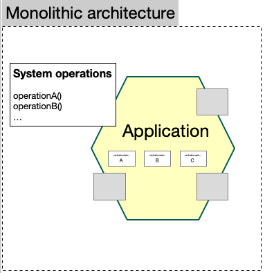
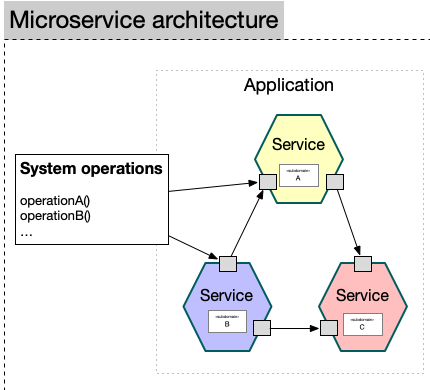

# Микросервисы с NestJS

Вебинар OTUS · [otus.ru](https://otus.ru)

**Владимир Языков**  
Powertech. Tech Lead / Principal Engineer

---

## О спикере

- в IT 10+ лет
- Tech Lead в Digital Advertising High-Load
- TS / Golang; PostgreSQL и MongoDB
- OTUS — 3 года, 150+ вебинаров, 1000+ студентов
- курсы Node.JS / MongoDB / PostgresDBA / NoSQL

Блог: https://medium.com/@nlapshin1989

---

## Правила вебинара

- Активно участвуем
- Off-topic — в Telegram
- Вопросы — в чат или голосом
- Ответ в чате может быть не сразу

---

## Цели вебинара

После занятия вы сможете:

1. Сравнить монолиты и микросервисы
2. Написать первый микросервис на NestJS

--

## Маршрут

1. Монолиты и микросервисы
2. Микросервисы с NestJS
3. Рефлексия

---

# Микросервисная архитектура

---

## Монолитная архитектура

- **Быстрый старт** — проще проектировать, нет сетевого взаимодействия
- **Модули внутри процесса** — транзакции и join проще
- **Единое развёртывание** — один сервис целиком
- **Единый стек** технологий
- **Цельная архитектура** — одинаковый подход к модулям

--

## Монолит. Схема



Поддомены `A`, `B`, `C` — в одном приложении

---

## Микросервисная архитектура

- **Модульность** — сервис = функция / набор функций + интерфейс
- **Взаимодействие** — чужие данные только через запрос к сервису
- **Независимое развёртывание**
- **Свой стек** на сервис
- **Разные требования** к разным сервисам

--

## Микросервисы. Схема



Поддомены — отдельные сервисы, общение через порты

---

## Преимущества

- **Linux way** — один сервис = одна ответственность
- **Гибкость разработки** — инструменты и команда под задачу
- **Независимость деплоя**

--

## Сложности

- Транзакции, join, логирование между сервисами
- Ошибки проектирования дорогие
- Разные подходы и свой набор паттернов
- **Сеть** ≠ 0 latency, нестабильна

---

## Паттерны

- Domain-Driven Design (DDD)
- Service registry / discovery
- API Gateway
- Retry requests
- Event sourcing
- Request Correlation ID

---

## Request Correlation ID

Один HTTP-запрос → несколько сервисов.  
Всем передаём один `correlationId`.

```text
Клиент → Gateway → Users → Mailer
         x-correlation-id: demo-001
```

--

## Correlation ID. Зачем

- **Отладка:** «не пришло письмо» → ищем цепочку по id
- **Логи:** связываем gateway / users / mailer без полного tracing
- **Инциденты:** один id в алерте и в тикете
- **Аудит:** событие `UserCreated` с тем же id
- **Ретраи:** отличить повтор от нового запроса
- **Метрики:** latency операции «регистрация» целиком

**Нужен:** 2+ сервиса, брокер, разные логи  
**Не обязателен:** монолит, один лог

--

## Correlation ID. Код

```typescript
// middleware: взять или сгенерировать
const id = req.header('x-correlation-id')?.trim() || randomUUID();
res.setHeader('x-correlation-id', id);

// gateway → users → mailer
createUser({ ...body, correlationId });
mailer.send({ cmd: 'user-create' }, { email, name, correlationId });
```

```bash
curl -i -X POST http://127.0.0.1:3000/users \
  -H 'x-correlation-id: demo-001' \
  -d '{"email":"anna@example.com","name":"Anna"}'
```

---

## Паттерн DDD

- Проектируем вокруг **доменной модели**
- Система = набор **контекстов**, у каждого своя модель
- Слои: репозиторий, сервис, агрегат и т.д.

В демо: `apps/users` — domain / infrastructure / service

---

## Взаимодействие сервисов

- Брокеры сообщений: RabbitMQ, Kafka, NATS, Redis
- Или напрямую: HTTP / **gRPC**

---

## Брокеры. В чём разница

Брокер — посредник: отправитель не знает, кто и когда обработает сообщение.

--

### Redis Pub/Sub

- Модель: Pub/Sub (часто fire-and-forget)
- По умолчанию **не хранит** сообщение
- Просто для демо и NestJS-примеров

--

### Apache Kafka

- Модель: лог событий (commit log)
- **Хранит** долго, можно перечитать
- Высокий throughput, много consumers

--

### RabbitMQ

- Очереди + маршрутизация
- Хранит до ack / TTL
- Классические очереди задач, routing

--

### NATS

- Лёгкий messaging
- JetStream — опциональное хранение
- Низкая задержка, cloud-native

---

## Redis vs Kafka

**Коротко:**  
Redis — «сейчас всем, кто слушает».  
Kafka — «запиши в лог, прочитай когда нужно».

--

### Сравнение

- **Суть:** Redis = store + Pub/Sub · Kafka = поток событий
- **Доставка:** Redis слаб при offline · Kafka — consumer догонит
- **Replay:** Redis нет · Kafka да (offset / group)
- **Эксплуатация:** Redis просто · Kafka сложнее
- **В демо:** Redis ✅ · Kafka ✗ (намеренно проще)

--

### Правило выбора

- быстрый старт / эфемерные команды → **Redis**
- журнал событий / много читателей / replay → **Kafka**

--

### Kafka: как это работает

Топик = **тетрадь, в которую только дописывают**.

```text
Users ──► [ user.created ]
           0: Anna  1: Boris  2: Clara
                │
     ┌──────────┼──────────┐
  mailer    analytics    audit
  (свой offset у каждой group)
```

- **Журнал** — сообщение не исчезает после чтения
- **Независимые читатели** — разные `groupId`, каждый свой курсор
- **Replay** — прочитать историю с начала / с нужного offset

--

### Kafka: несколько читателей (код)

```typescript
const producer = kafka.producer();
await producer.send({
  topic: 'user.created',
  messages: [{ value: JSON.stringify({ email: 'anna@...' }) }],
});

// group «mailer» — своё чтение
kafka.consumer({ groupId: 'mailer' });

// group «analytics» — то же событие, другой прогресс
kafka.consumer({ groupId: 'analytics' });
```

Одно событие → письмо **и** метрика. Группы не мешают друг другу.

--

### Kafka: replay (код)

```typescript
// новый сервис хочет всю историю
await consumer.subscribe({
  topic: 'user.created',
  fromBeginning: true, // с offset 0
});

// или откатить курсор
await consumer.seek({
  topic: 'user.created',
  partition: 0,
  offset: '0',
});
```

Redis Pub/Sub так не умеет: offline → сообщение потеряно.

---

## Node.js экосистема

Nest `@nestjs/microservices` — обёртка.  
Часто используют напрямую:

- **amqplib** → RabbitMQ
- **bullmq** → jobs на Redis
- **kafkajs** → Apache Kafka

--

### amqplib

Клиент для **RabbitMQ**.  
Сервис кладёт в очередь «отправь welcome», другой забирает и делает `ack`.  
Классическая очередь задач с маршрутизацией.

```typescript
ch.sendToQueue('welcome.email', Buffer.from(JSON.stringify({ email })));
ch.consume('welcome.email', (msg) => { /* ... */ ch.ack(msg); });
```

--

### bullmq — на словах

Очереди **фоновых jobs на Redis** (не просто Pub/Sub):

- регистрация → job «welcome-email» (можно delay 5 мин)
- PDF/отчёт ночью, не блокируя HTTP
- ресайз / импорт CSV, concurrency = 5
- SMTP упал → retry с backoff

BullMQ = отложенная работа и ретраи jobs.  
Nest `Transport.REDIS` = запрос–ответ / pub-sub между сервисами.

--

### kafkajs — на словах

Не «обработал и забыл», а **лента событий**.

`user.created` в топике читают независимо:
- Mailer — письмо
- Analytics — счётчик
- Audit — журнал

У каждого своя скорость (consumer group), историю можно перечитать.  
Для «отложи письмо на 5 минут» чаще BullMQ/RabbitMQ.

---

## Как соотносится с Nest

- RabbitMQ → `Transport.RMQ` (+ amqplib)
- Kafka → `Transport.KAFKA` (+ kafkajs)
- BullMQ → `@nestjs/bullmq` (не transport MS)
- Redis Pub/Sub → `Transport.REDIS` ← **наше демо**

---

## gRPC

- HTTP/2.0
- Protocol Buffers — бинарные данные
- Контракт в `.proto`

```protobuf
service TaskService {
  rpc GenerateHash (GenerateHashRequest)
    returns (GenerateHashResponse) {}
}
```

В демо: `POST /hash` → Gateway → gRPC Hash-сервис

---

# NestJS. Микросервисы

---

## Идея Nest microservices

- Пакет `@nestjs/microservices`
- Клиент–сервер
- Клиент: `ClientsModule` + `ClientProxy`
- Сервер: `createMicroservice` + `@MessagePattern`
- Транспорт: TCP / Redis / RabbitMQ / Kafka / …

---

## Сервер (обработка)

```typescript
const app = await NestFactory.createMicroservice(AppModule, {
  transport: Transport.REDIS,
  options: { host: '0.0.0.0', port: 6379 },
});
app.listen();
```

```typescript
@MessagePattern({ cmd: 'user-create' })
handle(user: any) {
  return this.appService.userCreate(user);
}
```

--

## Клиент (отправка)

```typescript
ClientsModule.register([{
  name: 'MAILER_SERVICE',
  transport: Transport.REDIS,
  options: { host: '0.0.0.0', port: 6379 },
}])
```

```typescript
@Inject('MAILER_SERVICE') private mailer: ClientProxy;

await lastValueFrom(
  this.mailer.send({ cmd: 'user-create' }, payload),
);
```

---

## Демо-проект репозитория

Онбординг пользователя:

1. `POST /users` → API Gateway
2. Users (Redis) + event store
3. Mailer `{ cmd: 'user-create' }`
4. `POST /hash` → gRPC GenerateHash

```bash
npm run start:redis
npm run start:all
```

---

## Рефлексия

С какими впечатлениями уходите с вебинара?

Опрос о занятии — ссылка в чате.

---

# Спасибо за внимание!

**Владимир Языков**
